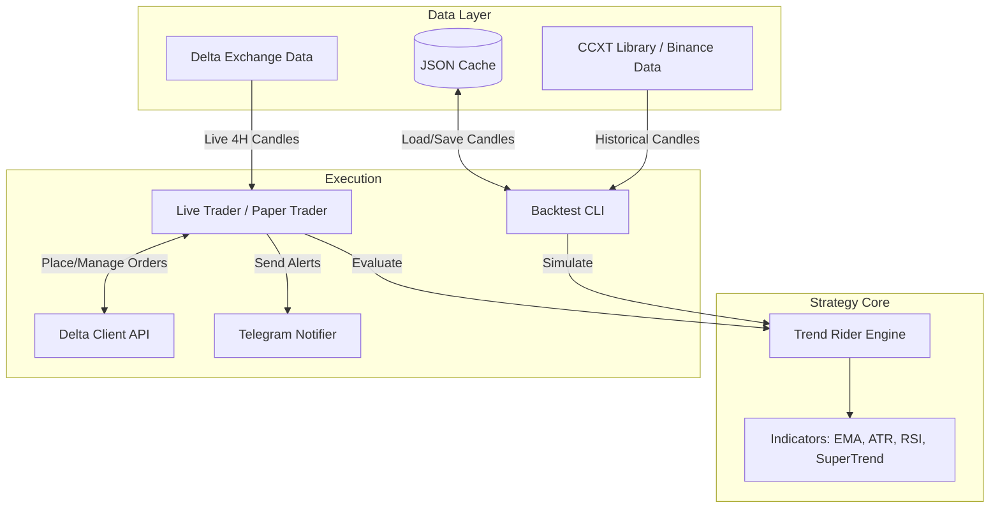

# 02: System Architecture

The 4H Crypto Trend Rider system is organized into decoupled modules, allowing for both rigorous backtesting on historical data and seamless execution in live markets. 

## High-Level Block Diagram

## Component Breakdown

### 1. Strategy Core (`trend_rider_engine.py`)
This is the mathematical heart of the system. It is entirely stateless regarding execution (it doesn't know if it's running a backtest or trading live). 
* **Responsibilities:** Calculates technical indicators (EMA, ATR, RSI, SuperTrend, Donchian), evaluates entry logic, and manages trailing stop state.
* **Key functions:** `compute_indicators()`, `run_trend_rider_backtest()`.

### 2. Live Execution Engine (`delta_trader.py`)
This script is the main entry point for real-world trading. It runs an infinite polling loop.
* **Responsibilities:** Periodically fetches recent 4H candles from the exchange, passes them to the Strategy Core, checks if a new trade should be entered or if an existing trade's stop-loss needs updating, and executes orders.
* **Integrates with:** `delta_client.py` for API requests.

### 3. Delta Exchange API Client (`delta_client.py` - Integrated)
A wrapper specifically for interacting with the Delta Exchange REST API v2.
* **Responsibilities:** Handles authentication, fetching live OHLCV data, creating market/stop orders, and fetching account balances.

### 4. Backtesting Framework (`backtest_cli.py` & `crypto_trend_backtest.py`)
Used for researching and validating the strategy. 
* **Responsibilities:** Fetches huge swaths of historical data via CCXT (defaulting to Binance for deep history), saves it to `cache/` to avoid repeated downloads, and runs the strategy engine over the data.
* **Outputs:** Detailed performance metrics (Win Rate, Profit Factor, Max Drawdown).

### 5. Telegram Notifier (`telegram_notifier.py`)
Provides real-time visibility into what the bot is doing without needing to watch the terminal.
* **Responsibilities:** Sends messages for startup, entry signals, order executions, and trade exits with R-multiple tracking.

## File Organization (The `yash_algo` Folder)

| File / Folder | Purpose |
|---------------|---------|
| `trend_rider_engine.py` | The mathematical logic for indicators and trade signals. |
| `delta_trader.py` | The live trading loop. Run this for production. |
| `backtest_cli.py` | The backtesting command-line tool. |
| `crypto_trend_backtest.py` | Helper functions for downloading backtest data. |
| `telegram_notifier.py` | Telegram bot integration. |
| `symbol_utils.py` | Normalizes symbol strings (e.g., `BTC/USDT` vs `BTCUSDT`). |
| `.env` | **CRITICAL:** Stores all user configurations and secrets. |
| `cache/` | Directory where historical candle data is saved for fast backtesting. |
| `doc/` | Documentation folder containing deep dives and this manual. |
